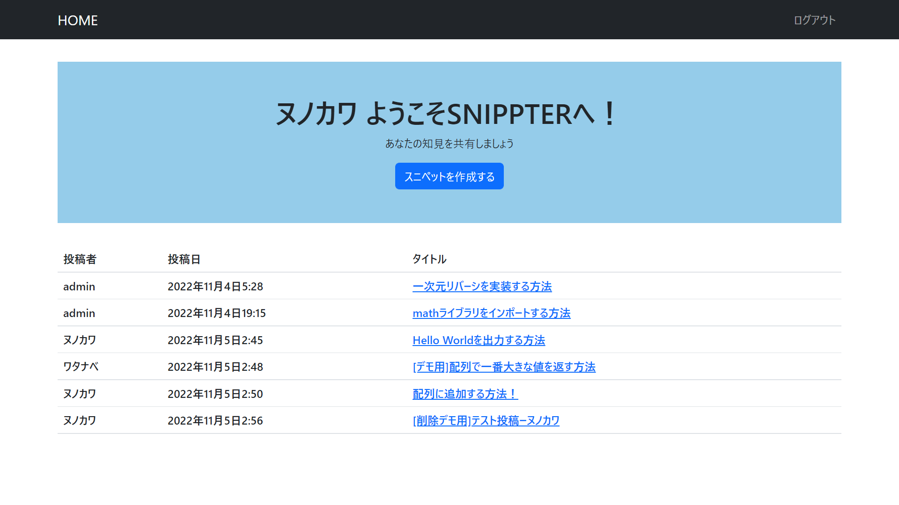

# SNIPPTER について

SNIPPETERはコードスニペットを保管・共有するためのWebアプリケーションです

作成者-布川昌憲

## SNIPPETERの機能
- 会員登録およびログイン
- コードスニペットの投稿
- 投稿したコードスニペットの編集
- 投稿したコードスニペットの削除
- コードスニペットへのコメント
- コメントの削除




## 環境構築

- １ django をインストール　
 ```
 $ pip install django
 ```
- 2 ファイルをダウンロードした先のディレクトリで実行
 ```
 $ python manage.py makemigrations
 $ python manage.py migrate
 $ pip install django-bootstrap5
 $ pip install django-pygments-renderer
 $ python manage.py runserner
 ```
 
- うまくいけば　http://127.0.0.1:8000/　　
にサーバーが立ち上がっているはずです
 
 
